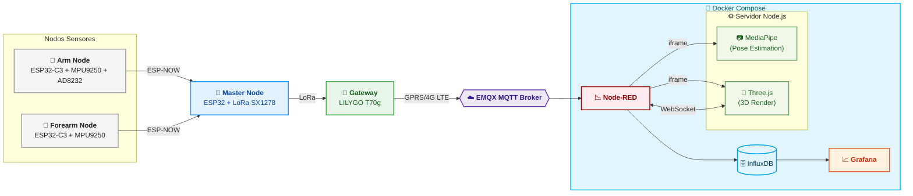

<div align="center">


</div>

# RehabiNodes

> Sistema de monitoreo inalámbrico basado en sensores y tecnologías open source que, al combinar unidades de medición inercial (IMU) y sensores de electromiografía/ECG, es capaz de capturar, procesar y visualizar en tiempo real el movimiento y la actividad muscular del brazo y antebrazo, con el propósito de mejorar la precisión en la ejecución de ejercicios y optimizar los procesos de rehabilitación física domiciliaria.

---

## 📖 Descripción

**RehabiNodes** es un prototipo de plataforma de rehabilitación física domiciliaria orientada a la recuperación funcional del brazo y antebrazo tras una lesión.

El sistema integra dos fuentes de datos complementarias:

- **Nodos IMU inalámbricos** (ESP32 + MPU9250) que miden la orientación y el movimiento en los 3 ejes del brazo y el antebrazo, permitiendo evaluar el rango articular y la calidad de ejecución de cada ejercicio.
- **Sensor ECG/EMG** (AD8232) embebido en el nodo de brazo, que captura la señal eléctrica muscular para detectar compensaciones, fatiga y nivel de activación durante la sesión.

Toda la información se visualiza en tiempo real a través de un panel centralizado (Node Red) que incluye un **modelo 3D interactivo simple** del brazo (Three.js), **estimación de ángulos y compensaciones por visión artificial** (MediaPipe), y **gráficas históricas de señales** (Grafana + InfluxDB).

---

## 🎯 Objetivo

Diseñar e implementar un sistema portátil e inalámbrico para la medición y análisis del movimiento del brazo y antebrazo, con el fin de:

- Guiar al paciente durante ejercicios de **movilidad motora**, **rango articular** y **estiramiento**.
- Apoyar la **readaptación progresiva y segura** después de una lesión, reintegrando al paciente a sus rutinas de forma controlada.
- Visualizar **compensaciones posturales** y movimientos inadecuados mediante estimación de ángulos y posición.
- Proporcionar al clínico **métricas** (rango de movimiento, actividad muscular, simetría) para el seguimiento terapéutico.

### Metas técnicas

- **Hardware sensorial:** Integrar y calibrar IMUs (MPU9250) en nodos de brazo y antebrazo para capturar ángulos de rotación y aceleración en 3 ejes.
- **Procesamiento de señales:** Filtrar y procesar datos brutos de sensores para interpretar movimientos y detectar compensaciones musculares inadecuadas.
- **Interfaz de usuario (Dashboard):** Desarrollar un panel en Node-RED con visualización en tiempo real (Three.js + MediaPipe) y seguimiento histórico (Grafana + InfluxDB).

---

## 🔬 Alcance del Prototipo

Este prototipo se centra exclusivamente en la rehabilitación del **brazo y antebrazo**. Las capacidades actuales son:

<table border="1" cellspacing="0" cellpadding="6">
  <thead>
    <tr>
      <th>Capacidad</th>
      <th>Implementación</th>
    </tr>
  </thead>
  <tbody>
    <tr>
      <td>Medición de movimiento en 3 ejes</td>
      <td>IMU MPU9250 en nodo de brazo y antebrazo</td>
    </tr>
    <tr>
      <td>Señal ECG / actividad muscular</td>
      <td>AD8232 en nodo de brazo</td>
    </tr>
    <tr>
      <td>Estimación de movimientos articulares</td>
      <td>Visualización de landmarks de MediaPipe</td>
    </tr>
    <tr>
      <td>Apoyo visual para la identificación de compensaciones</td>
      <td>MediaPipe y cálculo de ángulos</td>
    </tr>
    <tr>
      <td>Visualización 3D simple en tiempo real</td>
      <td>Three.js actualizado por WebSocket</td>
    </tr>
    <tr>
      <td>Almacenamiento y análisis histórico</td>
      <td>InfluxDB + Grafana</td>
    </tr>
    <tr>
      <td>Panel de control clínico</td>
      <td>Node-RED con iframes al servidor Node.js</td>
    </tr>
    <tr>
      <td>Comunicación inalámbrica de largo alcance</td>
      <td>ESP-NOW + LoRa + GPRS/4G + MQTT</td>
    </tr>
  </tbody>
</table>


> ⚠️ El análisis de postura corporal completa (cuerpo, cadera, rodillas y manos) **es compleentario** de este prototipo y podrá escalarse en versiones futuras.

---

## 🏗️ Arquitectura del Sistema y Flujo de Datos




---

# 🧠 Intelligent IMU Wireless Nodes - Docker Setup

## 📋 Descripción

Este proyecto utiliza contenedores Docker para ejecutar:

* Node-RED (procesamiento de datos y MQTT)
* WebServices (backend)
* InfluxDB (base de datos time-series)
* Grafana (visualización)

Incluye persistencia mediante volúmenes y soporte para backup/restore completo.

---

## 🚀 Comandos Básicos

### 🔹 Volúmenes

```bash
docker volume ls                 # Listar volúmenes
docker volume inspect <name>    # Ver detalles de un volumen
docker volume rm <name>         # Eliminar volumen
```

---

### 🔹 Docker Compose

```bash
docker-compose up -d --build    # Construir y levantar servicios
docker-compose down             # Detener y eliminar contenedores
```

---

## 🐳 Acceso a Contenedores

### Entrar a Node-RED

```bash
docker exec -it nodered bash
```

### Navegar en datos persistentes

```bash
cd /data
ls
```

---

## 💾 Backup de Volúmenes

Exporta todos los datos (InfluxDB, Grafana, Node-RED):

```powershell
docker run --rm `
-v releases_influxdb-data:/influxdb-data `
-v releases_influxdb-config:/influxdb-config `
-v releases_grafana-data:/grafana-data `
-v releases_node-red-data:/node-red-data `
-v ${PWD}:/backup `
alpine `
tar czf /backup/backup_full.tar.gz `
/influxdb-data /influxdb-config /grafana-data /node-red-data
```

Archivo generado:

```text
backup_full.tar.gz
```

---

## 🧹 Eliminar Volúmenes (Reset completo)

```bash
docker-compose down

docker volume rm releases_influxdb-data
docker volume rm releases_influxdb-config
docker volume rm releases_grafana-data
docker volume rm releases_node-red-data

docker volume ls
```

---

## ♻️ Restaurar Backup

```powershell
docker run --rm `
-v releases_influxdb-data:/influxdb-data `
-v releases_influxdb-config:/influxdb-config `
-v releases_grafana-data:/grafana-data `
-v releases_node-red-data:/node-red-data `
-v ${PWD}:/backup `
alpine `
tar xzf /backup/backup_full.tar.gz -C /
```

---

## ▶️ Levantar el Sistema

```bash
docker-compose up -d
```

---

## 🌐 Accesos

| Servicio    | URL                                              |
| ----------- | ------------------------------------------------ |
| Node-RED    | [http://localhost:1880/](http://localhost:1880/) |
| WebServices | [http://localhost:3000/](http://localhost:3000/) |
| InfluxDB    | [http://localhost:8086/](http://localhost:8086/) |
| Grafana     | [http://localhost:3001/](http://localhost:3001/) |

---

## 🧠 Notas Importantes

* Los volúmenes contienen:

  * InfluxDB: datos + configuración
  * Grafana: dashboards
  * Node-RED: flows y credenciales

* El backup es binario:

  * rápido
  * completo
  * no requiere reconfiguración

* Para restaurar correctamente:

  * eliminar volúmenes antes
  * luego ejecutar restore

---

## 📁 Requisitos para replicar el entorno

* `docker-compose.yml`
* carpetas de build (`nodered`, `webservices`)
* archivo de backup (`backup_full.tar.gz`)

---

## ⚠️ Consideraciones

* Asegurar mismas versiones de contenedores
* No modificar volúmenes manualmente
* Certificados TLS deben estar en rutas persistentes 

---