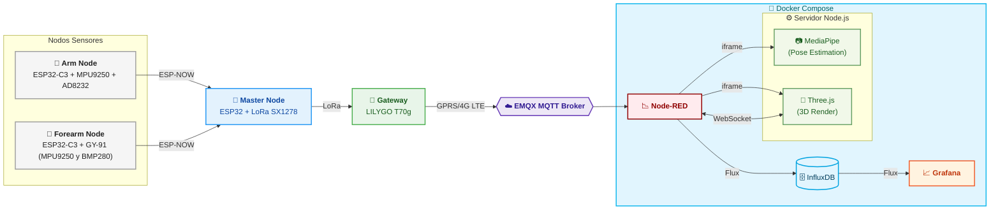

<div align="center">


</div>

# RehabiNodes

> Sistema de monitoreo inalámbrico basado en sensores y tecnologías open source que, al combinar unidades de medición inercial (IMU) y sensores de electromiografía/ECG, es capaz de capturar, procesar y visualizar en tiempo real el movimiento y la actividad muscular del brazo y antebrazo, con el propósito de mejorar la precisión en la ejecución de ejercicios y optimizar los procesos de rehabilitación física domiciliaria.

---

## 📖 Descripción

**RehabiNodes** es un prototipo de plataforma de rehabilitación física domiciliaria orientada a la recuperación funcional del brazo y antebrazo tras una lesión.

El sistema integra dos fuentes de datos complementarias:

- **Nodos IMU inalámbricos** (ESP32 + MPU9250) que miden la orientación y el movimiento en los 3 ejes del brazo y el antebrazo, permitiendo evaluar el rango articular y la calidad de ejecución de cada ejercicio.
- **Sensor ECG/EMG** (AD8232) embebido en el nodo de brazo, que captura la señal eléctrica muscular para detectar compensaciones, fatiga y nivel de activación durante la sesión.

Toda la información se visualiza en tiempo real a través de un panel centralizado (Node Red) que incluye un **modelo 3D interactivo simple** del brazo (Three.js), **estimación de ángulos y compensaciones por visión artificial** (MediaPipe), y **gráficas históricas de señales** (Grafana + InfluxDB).

---

## 🎯 Objetivo

Diseñar e implementar un sistema portátil e inalámbrico para la medición y análisis del movimiento del brazo y antebrazo, con el fin de:

- Guiar al paciente durante ejercicios de **movilidad motora**, **rango articular** y **estiramiento**.
- Apoyar la **readaptación progresiva y segura** después de una lesión, reintegrando al paciente a sus rutinas de forma controlada.
- Visualizar **compensaciones posturales** y movimientos inadecuados mediante estimación de ángulos y posición.
- Proporcionar al clínico **métricas** (rango de movimiento, actividad muscular, simetría) para el seguimiento terapéutico.

### Metas técnicas

- **Hardware sensorial:** Integrar y calibrar IMUs (MPU9250) en nodos de brazo y antebrazo para capturar ángulos de rotación y aceleración en 3 ejes.
- **Procesamiento de señales:** Filtrar y procesar datos brutos de sensores para interpretar movimientos y detectar compensaciones musculares inadecuadas.
- **Interfaz de usuario (Dashboard):** Desarrollar un panel en Node-RED con visualización en tiempo real (Three.js + MediaPipe) y seguimiento histórico (Grafana + InfluxDB).

---

## 🔬 Alcance del Prototipo

Este prototipo se centra exclusivamente en la rehabilitación del **brazo y antebrazo**. Las capacidades actuales son:

<table border="1" cellspacing="0" cellpadding="6">
  <thead>
    <tr>
      <th>Capacidad</th>
      <th>Implementación</th>
    </tr>
  </thead>
  <tbody>
    <tr>
      <td>Medición de movimiento en 3 ejes</td>
      <td>IMU MPU9250 en nodo de brazo y antebrazo</td>
    </tr>
    <tr>
      <td>Señal ECG / actividad muscular</td>
      <td>AD8232 en nodo de brazo</td>
    </tr>
    <tr>
      <td>Estimación de movimientos articulares</td>
      <td>Visualización de landmarks de MediaPipe</td>
    </tr>
    <tr>
      <td>Apoyo visual para la identificación de compensaciones</td>
      <td>MediaPipe y cálculo de ángulos</td>
    </tr>
    <tr>
      <td>Visualización 3D simple en tiempo real</td>
      <td>Three.js actualizado por WebSocket</td>
    </tr>
    <tr>
      <td>Almacenamiento y análisis histórico</td>
      <td>InfluxDB + Grafana</td>
    </tr>
    <tr>
      <td>Panel de control clínico</td>
      <td>Node-RED con iframes al servidor Node.js</td>
    </tr>
    <tr>
      <td>Comunicación inalámbrica de largo alcance</td>
      <td>ESP-NOW + LoRa + GPRS/4G + MQTT</td>
    </tr>
  </tbody>
</table>


> ⚠️ El análisis de postura corporal completa (cuerpo, cadera, rodillas y manos) **es compleentario** de este prototipo y podrá escalarse en versiones futuras.

---

## 🏗️ Arquitectura del Sistema y Flujo de Datos



<table border="1" cellspacing="0" cellpadding="8">
  <thead>
    <tr>
      <th>Componente</th>
      <th>Rol funcional en el flujo</th>
    </tr>
  </thead>
  <tbody>
    <tr>
      <td><strong>node_arm</strong><br/><small>ESP32-C3 + MPU9250 + AD8232</small></td>
      <td>Captura IMU (orientación) y ECG del brazo. Transmite por ESP‑NOW al maestro.</td>
    </tr>
    <tr>
      <td><strong>node_forearm</strong><br/><small>ESP32-C3 + GY‑91 (MPU9250 + BMP280)</small></td>
      <td>Captura IMU del antebrazo. Transmite por ESP‑NOW al maestro. (BMP280 no usado activamente)</td>
    </tr>
    <tr>
      <td><strong>master_node</strong><br/><small>ESP32 + LoRa Ra‑02 SX1278</small></td>
      <td>Agrega datos de ambos nodos vía ESP‑NOW y los retransmite por LoRa hacia el gateway.</td>
    </tr>
    <tr>
      <td><strong>gateway</strong><br/><small>LILYGO T‑SIM7070G + LoRa</small></td>
      <td>Recibe el paquete LoRa y lo publica al broker MQTT usando GPRS/4G LTE.</td>
    </tr>
    <tr>
      <td><strong>Broker MQTT (EMQX)</strong></td>
      <td>Punto de entrada único al backend. Desacopla la capa de hardware del procesamiento.</td>
    </tr>
    <tr>
      <td><strong>Node‑RED</strong></td>
      <td>Hub de integración: suscribe MQTT, normaliza datos, los envía a InfluxDB y al servidor web (vía WebSocket/HTTP).</td>
    </tr>
    <tr>
      <td><strong>ExpressJS (servidor Node.js)</strong></td>
      <td>Sirve las interfaces de MediaPipe y Three.js. Gestiona el WebSocket que actualiza el modelo 3D.</td>
    </tr>
    <tr>
      <td><strong>Three.js</strong></td>
      <td>Renderiza el modelo 3D del brazo/antebrazo en el navegador, actualizado en tiempo real por WebSocket.</td>
    </tr>
    <tr>
      <td><strong>MediaPipe JS</strong></td>
      <td>Estima ángulos articulares y detecta compensaciones motoras mediante visión por computadora (landmarks).</td>
    </tr>
    <tr>
      <td><strong>InfluxDB</strong></td>
      <td>Almacena series temporales de IMU y ECG para análisis histórico y trazabilidad de sesiones.</td>
    </tr>
    <tr>
      <td><strong>Grafana</strong></td>
      <td>Dashboards de evolución clínica: rangos de movimiento, actividad muscular, simetría, alertas.</td>
    </tr>
  </tbody>
</table>

---

## 📡 Protocolos de Comunicación

<table>
  <thead>
    <tr>
      <th>Protocolo</th>
      <th>Función en el proyecto</th>
      <th>Descripción breve</th>
    </tr>
  </thead>
  <tbody>
    <tr>
      <td><strong>ESP-NOW</strong></td>
      <td>Comunicación entre nodos (brazo/antebrazo) y nodo maestro</td>
      <td>Protocolo peer-to-peer sin conexión WiFi de Espressif, baja latencia</td>
    </tr>
    <tr>
      <td><strong>LoRa (SX1278)</strong></td>
      <td>Enlace inalámbrico nodo maestro → gateway</td>
      <td>Modulación de espectro ensanchado para largo alcance y bajo consumo</td>
    </tr>
    <tr>
      <td><strong>GPRS / 4G LTE</strong></td>
      <td>Gateway → Broker MQTT (transmisión celular)</td>
      <td>Red móvil de datos para enviar información a la nube</td>
    </tr>
    <tr>
      <td><strong>MQTT</strong></td>
      <td>Broker ↔ Node-RED y publicaciones desde gateway/mocks</td>
      <td>Protocolo ligero de publicación/suscripción sobre TCP/IP</td>
    </tr>
    <tr>
      <td><strong>WebSocket</strong></td>
      <td>Servidor ExpressJS ↔ Three.js (modelo 3D)</td>
      <td>Canal bidireccional full-duplex sobre una única conexión TCP</td>
    </tr>
    <tr>
      <td><strong>HTTP / HTTPS</strong></td>
      <td>Servidor ExpressJS entrega archivos estáticos y rutas REST</td>
      <td>Protocolo cliente-servidor para transferencia de hipertexto</td>
    </tr>
    <tr>
      <td><strong>I²C (I2C)</strong></td>
      <td>Comunicación ESP32-C3 ↔ MPU9250 y ESP32-C3 ↔ AD8232</td>
      <td>Bus serie síncrono de dos hilos (SDA/SCL) para sensores</td>
    </tr>
    <tr>
      <td><strong>SPI</strong></td>
      <td>ESP32 ↔ Módulo LoRa SX1278 (nodo maestro)</td>
      <td>Bus serie síncrono full-duplex con selección de esclavo</td>
    </tr>
    <tr>
      <td><strong>UART (Serial)</strong></td>
      <td>Depuración (Serial Monitor) y posible comunicación entre módulos</td>
      <td>Comunicación asíncrona simple con TX/RX</td>
    </tr>
    <tr>
      <td><strong>USB (CDC)</strong></td>
      <td>Carga de firmware y monitoreo serial en ESP32-C3/ESP32</td>
      <td>USB nativo o serial-over-USB para programación y debug</td>
    </tr>
  </tbody>
</table>


### Hardware de Sensado y Adquisición

<table>
  <thead>
    <tr>
      <th>Componente</th>
      <th>Rol</th>
      <th>Notas</th>
    </tr>
  </thead>
  <tbody>
    <tr>
      <td><strong>ESP32-C3 Super Mini</strong></td>
      <td>MCU de los nodos de brazo y antebrazo</td>
      <td>Bajo consumo, formato compacto</td>
    </tr>
    <tr>
      <td><strong>ESP32</strong></td>
      <td>MCU del nodo maestro</td>
      <td>Mayor cantidad de pines para LoRa y periféricos</td>
    </tr>
    <tr>
      <td><strong>LILYGO T-SIM7070G</strong></td>
      <td>Gateway con conectividad celular</td>
      <td>GPRS/4G LTE integrado + interfaz para LoRa</td>
    </tr>
    <tr>
      <td><strong>MPU9250</strong></td>
      <td>IMU 9-DOF (brazo)</td>
      <td>Acelerómetro + giroscopio + magnetómetro</td>
    </tr>
    <tr>
      <td><strong>GY-91</strong></td>
      <td>IMU + barómetro (antebrazo)</td>
      <td>Integra MPU9250 y BMP280 (altitud/temperatura)</td>
    </tr>
    <tr>
      <td><strong>AD8232</strong></td>
      <td>Sensor ECG / EMG (brazo)</td>
      <td>Captura de señal eléctrica muscular</td>
    </tr>
    <tr>
      <td><strong>Ra-02 SX1278</strong></td>
      <td>Módulo LoRa</td>
      <td>Enlace nodo maestro ↔ gateway. Bajo consumo, largo alcance</td>
    </tr>
  </tbody>
</table>

### Backend e Infraestructura

<table>
  <thead>
    <tr>
      <th>Tecnología</th>
      <th>Rol</th>
    </tr>
  </thead>
  <tbody>
    <tr>
      <td><strong>Node.js + ExpressJS</strong></td>
      <td>Servidor HTTP, WebSocket y archivos estáticos</td>
    </tr>
    <tr>
      <td><strong>InfluxDB</strong></td>
      <td>Base de datos de series temporales (IMU, ECG)</td>
    </tr>
    <tr>
      <td><strong>Docker + Docker Compose</strong></td>
      <td>Contenerización de todo el stack</td>
    </tr>
  </tbody>
</table>

### Visualización en Tiempo Real

<table>
  <thead>
    <tr>
      <th>Tecnología</th>
      <th>Rol</th>
    </tr>
  </thead>
  <tbody>
    <tr>
      <td><strong>Node-RED</strong></td>
      <td>Dashboard principal, integración MQTT, iframes y WebSocket</td>
    </tr>
    <tr>
      <td><strong>Three.js</strong></td>
      <td>Modelo 3D del brazo/antebrazo actualizado por WebSocket</td>
    </tr>
    <tr>
      <td><strong>MediaPipe JS</strong></td>
      <td>Estimación de ángulos articulares y detección de compensaciones por cámara</td>
    </tr>
    <tr>
      <td><strong>Grafana</strong></td>
      <td>Dashboards históricos y alertas clínicas</td>
    </tr>
  </tbody>
</table>

> [!NOTE]  
> Todas las tecnologías listadas son **open source** o con **licencia de uso libre**.

---

## 📁 Estructura del Repositorio

```bash
📁 RehabiNodes/
├── 📁 3D-Model/           # Modelos STL de carcasas para impresión 3D
├── 📁 Project/            # Desarrollo completo del sistema
│   ├── 📁 IoT/            # Firmware ESP32 (nodos, gateway y maestro)
│   ├── 📁 webservices/    # Backend Node.js + visualización (Three.js, MediaPipe)
│   ├── 📁 mocks/          # Simulación de datos sin hardware físico
│   └── 📁 Dashboard/      # Exportaciones de dashboards (Node-RED / Grafana / InfluxDB)
├── 📁 Tests/              # Pruebas y experimentación por subsistema
├── 📁 Wiring-Diagrams/    # Diagramas eléctricos y de conexión
├── 📁 Releases/           # Despliegue con Docker Compose
└── README.md
```

<details>
<summary>📂 Ver estructura interna por sección</summary>

### 📁 IoT
```bash
📁 IoT/
├── 📁 gateway/         # Gateway LILYGO (LoRa → MQTT vía red celular)
├── 📁 master_node/     # Nodo maestro (agregación ESP-NOW → LoRa)
├── 📁 node_arm/        # Nodo de brazo (IMU + ECG)
└── 📁 node_forearm/    # Nodo de antebrazo (IMU)
```

### 📁 webservices
```bash
📁 webservices/
├── 📁 MediaPipe/       # Procesamiento local de visión (landmarks y ángulos)
├── 📁 Threejs/         # Modelo 3D actualizado vía WebSocket
└── 📁 server/          # Servidor Express (HTTP + WebSocket)
```

### 📁 mocks
```bash
📁 mocks/
├── 📁 master_node_direct_mqtt/  # Simulación: envío directo a MQTT sin LoRa/gateway
├── 📁 mqtt/                     # Scripts, certificados y pruebas de broker MQTT
├── 📁 simulated_node_arm/       # Nodo de brazo con datos simulados (IMU + ECG)
└── 📁 simulated_node_forearm/   # Nodo de antebrazo con datos simulados (IMU)
```

### 📁 Tests
```bash
📁 Tests/
├── 📁 Communication-Unused/  # Pruebas de LoRa, MQTT, ESP-NOW, WiFi (no integradas)
├── 📁 MPU/                   # Calibración y pruebas del MPU9250
├── 📁 node-red/              # Ejemplos de dashboards y flujos
├── 📁 test-ecg/              # Pruebas del sensor AD8232
├── 📁 test-mediapipe/        # Prototipos con MediaPipe JS
├── 📁 test-threejs/          # Prototipos Three.js + WebSocket
└── 📁 deprecated/            # Experimentos descartados
```

### 📁 Wiring-Diagrams
```bash
📁 Wiring-Diagrams/
├── Connections-ESP32C3-MPU9250-AD8232.svg  # Prototipo IoT
├── Connections-ESP32-LoRaSX1278.svg        # Conexiones con el modulo LoRa
└── Connections-Lilygo7070g-LoRaSX1278.svg     # LILYGO + LoRa
```

### 📁 Releases
```bash
📁 Releases/
├── 📁 nodered/            # Imagen personalizada de Node-RED
├── backup_full.tar.gz     # Backup de volúmenes (InfluxDB, Grafana, Node-RED)
└── docker-compose.yml     # Orquestación completa del sistema
```

</details>

## 🔌 Diagramas de Conexión

Los diagramas de conexión física se encuentran en [`Project/Wiring-Diagrams/`](./Project/Wiring-Diagrams/).

| Diagrama | Descripción |
|---|---|
| [`Connections-ESP32C3-MPU9250-AD8232.svg`](./Project/Wiring-Diagrams/Connections-ESP32C3-MPU9250-AD8232.fzz.svg) | Conexión del nodo de brazo: ESP32-C3 Super Mini + MPU9250 (IMU) + AD8232 (ECG/EMG) |
| [`Connections-ESP32-LoRaSX1278.svg`](./Project/Wiring-Diagrams/Connections-ESP32-LoRaSX1278.svg) | Conexión del nodo maestro: ESP32 + módulo LoRa Ra-02 SX1278 |
| [`Connections-Lilygo7070g-LoRaSX1278.svg`](./Project/Wiring-Diagrams/Connections-Lilygo7070g-LoRaSX1278.svg) | Conexión del gateway: LILYGO T-SIM7070G + módulo LoRa Ra-02 SX1278 |

---

# 🧠 Intelligent IMU Wireless Nodes - Docker Setup

## 📋 Descripción

Este proyecto utiliza contenedores Docker para ejecutar:

* Node-RED (procesamiento de datos y MQTT)
* WebServices (backend)
* InfluxDB (base de datos time-series)
* Grafana (visualización)

Incluye persistencia mediante volúmenes y soporte para backup/restore completo.

---

## 🚀 Comandos Básicos

### 🔹 Volúmenes

```bash
docker volume ls                 # Listar volúmenes
docker volume inspect <name>    # Ver detalles de un volumen
docker volume rm <name>         # Eliminar volumen
```

---

### 🔹 Docker Compose

```bash
docker-compose up -d --build    # Construir y levantar servicios
docker-compose down             # Detener y eliminar contenedores
```

---

## 🐳 Acceso a Contenedores

### Entrar a Node-RED

```bash
docker exec -it nodered bash
```

---

## 💾 Backup de Volúmenes

Exporta todos los datos (InfluxDB, Grafana, Node-RED):

```powershell
docker run --rm `
-v releases_influxdb-data:/influxdb-data `
-v releases_influxdb-config:/influxdb-config `
-v releases_grafana-data:/grafana-data `
-v releases_node-red-data:/node-red-data `
-v ${PWD}:/backup `
alpine `
tar czf /backup/backup_full.tar.gz `
/influxdb-data /influxdb-config /grafana-data /node-red-data
```

Archivo generado:

```text
backup_full.tar.gz
```

---

## 🧹 Eliminar Volúmenes (Reset completo)

```bash
docker-compose down

docker volume rm releases_influxdb-data
docker volume rm releases_influxdb-config
docker volume rm releases_grafana-data
docker volume rm releases_node-red-data

docker volume ls
```

---

## ♻️ Restaurar Backup

```powershell
docker run --rm `
-v releases_influxdb-data:/influxdb-data `
-v releases_influxdb-config:/influxdb-config `
-v releases_grafana-data:/grafana-data `
-v releases_node-red-data:/node-red-data `
-v ${PWD}:/backup `
alpine `
tar xzf /backup/backup_full.tar.gz -C /
```

---

## 🌐 Accesos

| Servicio    | URL                                              |
| ----------- | ------------------------------------------------ |
| Node-RED    | [http://localhost:1880/](http://localhost:1880/) |
| WebServices | [http://localhost:3000/](http://localhost:3000/) |
| InfluxDB    | [http://localhost:8086/](http://localhost:8086/) |
| Grafana     | [http://localhost:3001/](http://localhost:3001/) |

---